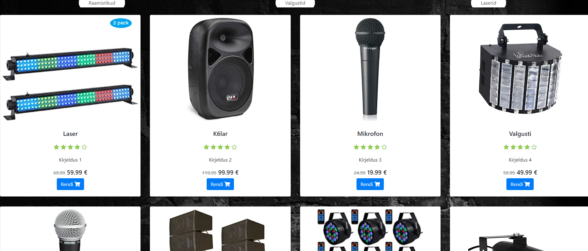

#Projekt Rendifirma laorakendus

Selle veebirakenduse eesmärk on vahendada firmal laost tellijatele tehnikat, mida saab kasutada ürituste korraldamiseks.
Tellijatel on võimalus vaadata ka firmal eelnevalt tehtud töid. Küsimuste korral on võimalik vaadata kontaktandmeid, kui peaks
küsimusi millegi kohta tekkima. Võimalus on luua ka kasutaja. 
Töö tehti digitehnoloogia instituudis suvepraktika raames. 
Kasutatud tehnoloogiad: Discord (hilisem), Putty (hilisem), Visual Studio Code (1.46.0), WinSCP (hilisem)
Projekti panustanid: Raimond Laatspera, Ralf Vihmaru, Rene Raidmaa, Taavi Vestel. 
Kui seda tööle panna, on vaja serverit, millel on olemas php tugi. Kasutasime koolis greeny serverit.
Andmebaaside jaoks kasutasime phpMyAdmin-i, mis on kooli poolt olemas. 

Pildid meie projektist: 

