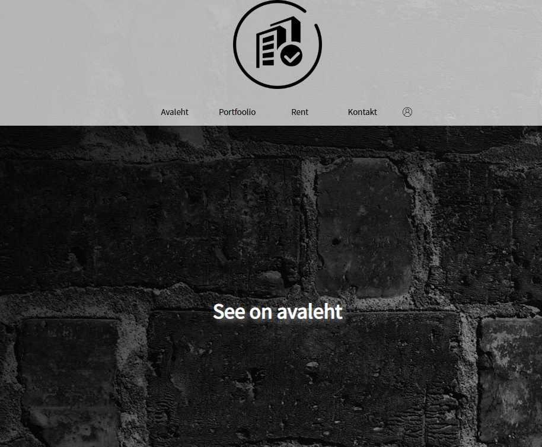

# Projekt Rendifirma laorakendus

Selle veebirakenduse eesmärk on vahendada firmal laost tellijatele tehnikat, mida saab kasutada ürituste korraldamiseks.
Tellijatel on võimalus vaadata ka firmal eelnevalt tehtud töid. Küsimuste korral on võimalik vaadata kontaktandmeid, kui peaks
küsimusi millegi kohta tekkima. Võimalus on luua ka kasutaja. 
Töö tehti digitehnoloogia instituudis suvepraktika raames. 
## Kasutatud tehnoloogiad
* HTML
* PHP 7.2
* CSS
* JavaScript
* MySQL
* jQuery 3.5.1

## Projekti panustanid 
* Raimond Laatspera
* Ralf Vihmaru 
* Rene Raidmaa 
* Taavi Vestel. 

## Installeerimise juhend
* Installeerida ja seadistada PHP ja MySQL.
* Laadida alla GitHub'is olevad failid ning panna need serverisse.
* Muuta config fail enda jaoks sobivaks.
* Võtta SQL fail ning luua MySQL'is andmebaas.
* Pane server tööle.

Pildid meie projektist: 

